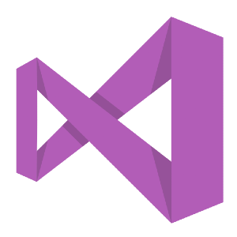
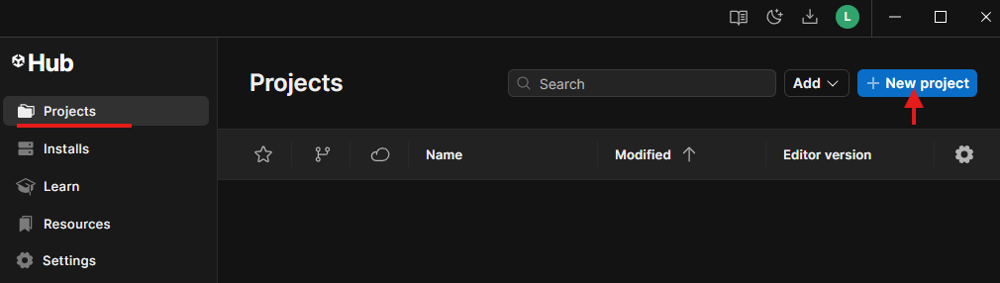
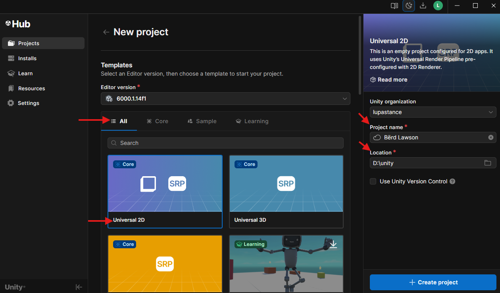
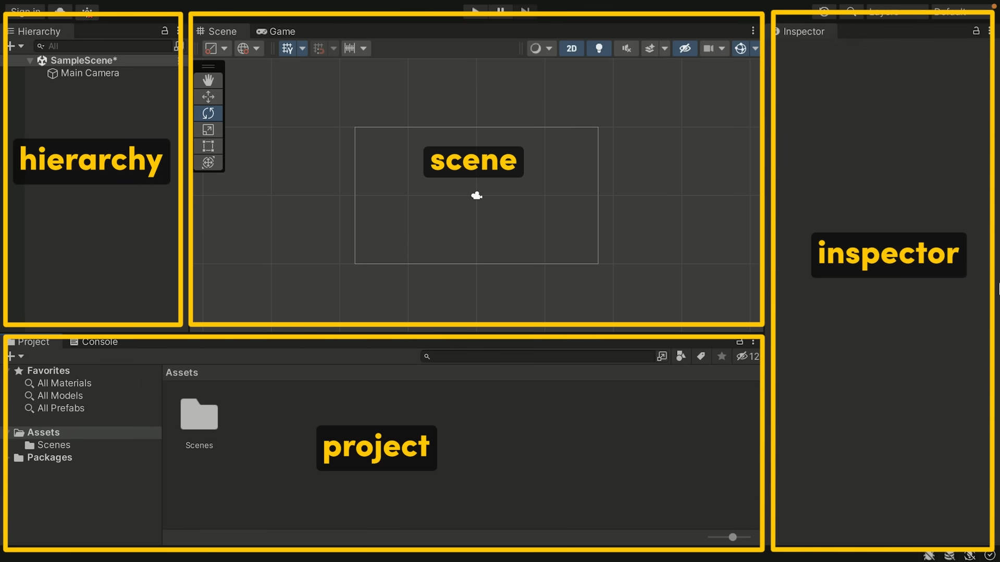

# 📦 Unity

{align=right}

En este primer tema vamos a conocer la herramienta principal sobre la que construiremos todo nuestro proyecto 👉 **Unity**.

Antes de ponernos a crear niveles, `scripts` o físicas, es importante entender qué es exactamente Unity, cómo se instala, por qué es una buena opción para aprender desarrollo de videojuegos y qué nos ofrece en comparación con otras alternativas.

---

## ❓ Qué es Unity

**Unity** es un motor de desarrollo de videojuegos **multiplataforma** que permite crear juegos en 2D, 3D e incluso experiencias interactivas como simuladores, aplicaciones de realidad virtual (VR), realidad aumentada (AR) o visualizaciones arquitectónicas.

Lo que hace a Unity tan poderoso es que combina varias herramientas clave en un solo entorno:

* Un editor visual para montar escenas con objetos, luces, cámaras y físicas.
* Un sistema de scripting basado en **C#**, que te permite programar el comportamiento de los objetos.
* Herramientas para importar recursos (imágenes, sonidos, animaciones, modelos 3D).
* Opciones de exportación a casi cualquier plataforma: PC, web, móviles, consolas, etc.

!!!note "Por qué usar Unity"
    Unity es uno de los motores más populares del mundo, y no es por casualidad. Aquí algunas razones por las que es una excelente opción para este y otros proyectos

    ‼️Es un ecosistema completo que te permite pasar de una idea a un juego funcional sin necesidad de reinventar la rueda.

✅ Gratuito para aprender

    Unity tiene un plan llamado **Unity Personal**, completamente gratuito para estudiantes, desarrolladores indie y personas con ingresos anuales menores a 100.000 USD. Puedes usarlo sin ninguna limitación en cuanto a funcionalidades.

✅ Multiplataforma

    Con Unity puedes desarrollar para Windows, macOS, Linux, Android, iOS, WebGL, consolas y más… sin tener que reescribir el código para cada plataforma.

✅ Visual + Programación

    Ofrece un entorno visual (Editor de Unity) en el que puedes arrastrar objetos, ajustar parámetros y ver resultados en tiempo real, pero también te permite controlar todo con código, usando C#. Ideal para artistas que están aprendiendo a programar y para programadores que quieren visualizar su trabajo.

✅ Comunidad inmensa

    Al ser tan extendido, encontrarás miles de recursos: tutoriales, plugins, documentación, foros, canales de YouTube, y paquetes ya hechos que puedes integrar fácilmente en tus proyectos.

✅ Usado profesionalmente

    Unity se utiliza tanto en proyectos independientes como en desarrollos profesionales, desde juegos móviles famosos hasta prototipos de empresas como NASA o estudios de animación.

## ⚙️ Instalación

Para instalar Unity necesitamos descargar la herramienta de gestión de los productos de Unity, llamada `Unity Hub` donde podremos seleccionar, además de Unity, otras herramientas de diseño y desarrollo.

Además, necesitaremos un editor de código fuente como **Visual Studio Code** o **Visual Studio**.

Por norma general, Visual Studio es más fácil de instalar, pero es verdad que consume muchos recursos y necesitaremos más memoria RAM a la hora de tener abiertos tanto Unity como Visual Studio para desarrollar nuestro juego.

Os recomiendo usar `Visual Studio Code` ya que es más liviano, consume menos recursos y funciona de la misma manera. La única ❌ desventaja es que hay que configurar tanto VSCode como Unity para que funcione correctamente, pero solo tardamos un par de minutos en hacerlo.

### Unity Hub

Unity Hub es una aplicación oficial de Unity que sirve como centro de control para gestionar todos tus proyectos, versiones del motor Unity, módulos adicionales y configuraciones relacionadas con el desarrollo.

Tenemos varias maneras de descargar Unity Hub:

=== "🌍 A través de la web de Unity"
    [🏃‍♂️ Ve a la web oficial de Unity](https://unity.com/es/download){target=blank}

=== "🌐 Usando Winget"
    ```bash
        winget install Unity.UnityHub
    ```

=== "👇 Desde Aquí"
    [1️⃣ Parte 1 de 2](assets/UnityHubSetup.zip.001)<br>
    [2️⃣ Parte 2 de 2](assets/UnityHubSetup.zip.002)

---

#### Instalando Unity

Una vez descargado e instalado, tendremos que crear una **cuenta en Unity** y después de loguearnos nos preguntará si queremos instalar el 👉 Editor de Unity 👈, seleccionaremos la ubicación donde se copiarán los archivos e instalamos el software.


/// caption
`Instalando el editor de Unity`
///

---

{align=left width=300}

Una vez seleccionada la ubicación de instalación, el programa empezará a descargar el `Editor de Unity` y se instalará automáticamente junto con ciertas herramientas necesarias que deben instalarse para poder ejecutar Unity en el ordenador.

---

#### 👀 OPCIONAL 👀 Instalando Visual Studio
{ align=right width=150 class="png"}

Aunque lo normal es hacer uso de `Visual Studio` también puedes utilizar **Visual Studio** para programar tus `scripts` que vayas a utilizar en Unity.

Con Visual Studio tendrás más compatibilidad con Unity a la hora de hacer uso del *Intellisense*(1) desde que instalas el software, aunque con Visual Studio Code podrás lograr el mismo resultado pero requiere que se instalen ciertas extensiones adicionales que veremos a continuación.
{ .annotate }

1.  **IntelliSense** es una característica de los editores de código y entornos de desarrollo integrado (*IDE*) que facilita la codificación al ofrecer ayuda para la finalización de código, información sobre parámetros y miembros, y más.<br><br>ℹ️ Es una herramienta útil para la productividad y la reducción de errores al escribir código.
   
La única ❌desventaja❌ de usar **Visual Studio** es que requiere bastante más memoria RAM y puede que a la hora de guardar nuestros `scripts` y sincronizarse con Unity, tarde un poco más de la cuenta.

## ➕ Creando un proyecto

Crear un nuevo proyecto en Unity es el primer paso para dar vida a tus ideas. Desde Unity Hub, podemos definir el tipo de proyecto, su nombre, ubicación y versión del editor que utilizaremos. Una buena configuración inicial nos asegura trabajar con la plantilla y herramientas adecuadas desde el principio, evitando problemas más adelante.

---



### 1️⃣ Empezamos

- En el panel lateral izquierdo, selecciona "Projects".
- Ahí verás todos tus proyectos recientes (si es la primera vez, estará vacío).
- Pulsa el botón "New Project" o "Nuevo Proyecto" (según idioma).
- Aparecerá una ventana con varias opciones.

---



### 2️⃣ Configurando el proyecto

- 2D 👉 para juegos y aplicaciones en dos dimensiones, ***este es nuestro caso***
- `Project Name` 👉 Escribe el nombre del proyecto, por ejemplo **Berd Lawson**
- `Location` 👉 Elige una carpeta donde Unity guardará todos los archivos del proyecto
- Haz clic en **"Create project"**

!!!bug "Ahora toca esperar un poco..."
    🙃 `Unity Hub` descargará y creará todos los archivos base y abrirá el Editor de Unity<br>
    ⌛ El tiempo de carga inicial puede tardar varios minutos especialmente en ordenadores lentos o con HDD

### 3️⃣ Interfaz principal de Unity



Cuando abres un proyecto en Unity, te encontrarás con la pantalla principal del Editor, el centro de trabajo donde crearás y gestionarás tu juego o aplicación. Esta interfaz está compuesta por paneles como Scene (para colocar y modificar objetos en el mundo), Game (para previsualizar el juego), Hierarchy (lista de todos los objetos en la escena), Inspector (para ajustar sus propiedades) y Project (donde se almacenan todos los archivos y recursos). Conociendo la función de cada panel y cómo se relacionan entre sí, podrás moverte con agilidad y optimizar tu flujo de trabajo en Unity.

=== "📚 Hierarchy"
        Lista todos los objetos de la escena actual en forma jerárquica. Aquí puedes organizar elementos en grupos, crear objetos vacíos para estructurar mejor la escena y seleccionar rápidamente cualquier elemento para editarlo en el Inspector.

=== "🎞️ Scene"
        Es el espacio donde construyes y organizas tu juego o aplicación. Aquí puedes colocar, mover, rotar y escalar objetos, así como ajustar su posición en el mundo 3D o 2D. Es la “vista de trabajo” donde puedes manipular elementos libremente sin necesidad de ejecutar el juego.

=== "🕹️ Game"
        Muestra cómo se verá tu juego durante la ejecución. Es una previsualización en tiempo real de la cámara principal de tu escena. Aunque puedes interactuar en esta vista, no es el lugar para editar objetos, sino para probar y ajustar cómo se percibe el resultado final.

=== "🗃️ Project"
        Contiene todos los recursos del proyecto, como modelos, texturas, sonidos, scripts, animaciones y escenas. Está organizado como una carpeta raíz con subcarpetas. Lo que ves aquí corresponde al contenido real de la carpeta Assets en tu disco duro.

=== "🔍 Inspector"
        Muestra y permite modificar todas las propiedades del objeto seleccionado. Desde aquí puedes cambiar componentes (como transformaciones, scripts o materiales), ajustar configuraciones y añadir nuevos elementos a cualquier `GameObject`.

=== "⬛ Console"
        Registra mensajes, advertencias y errores generados por Unity o por tu código. Es esencial para depurar y diagnosticar problemas mientras desarrollas tu proyecto.


## 💡 Conceptos básicos

En esta sección aprenderás los fundamentos esenciales de Unity, el motor de desarrollo sobre el que construiremos nuestros proyectos. Antes de empezar a crear juegos o aplicaciones interactivas, es importante entender cómo Unity organiza y gestiona los elementos que forman una escena: desde los `GameObjects` que representan cualquier objeto en el mundo virtual, hasta los Componentes que definen su comportamiento y apariencia. Estos conceptos básicos serán la base sobre la que desarrollaremos el resto del curso.

### 🍱 Game Object

En Unity, un `GameObject` es la unidad básica que compone cualquier cosa en una escena. Podríamos decir que es como una caja vacía que, por sí sola, no hace nada, pero que puede convertirse en cualquier elemento del juego al añadirle `Componentes`.

!!!bug "Ejemplo"
    un personaje, una cámara, una luz o incluso un objeto invisible que controla la lógica del juego, todos son GameObjects.

---

- **Ejemplo**: un personaje, una cámara, una luz o incluso un objeto invisible que controla la lógica del juego, todos son GameObjects.
- **Estructura**: cada `GameObject` siempre tiene un componente `Transform` (posición, rotación y escala en el espacio), y a partir de ahí puedes añadir otros como `Mesh Renderer` (para que se vea), `Collider` (para detectar colisiones) o `scripts` para que tenga comportamiento.
- **Analogía**: imagina un `GameObject` como un maniquí sin ropa. No se ve ni hace nada hasta que le añades ropa, accesorios y herramientas (componentes) que le dan forma y función.

### 📌 Componente

Son las piezas que añaden propiedades y comportamientos a un GameObject. Por ejemplo, un `Transform` define la posición, rotación y escala; un `Mesh Renderer` lo hace visible; un `Rigidbody` le permite interactuar con la física. Cada `GameObject` puede tener múltiples componentes para definir cómo debe comportarse.

### 📽️Escena (Scene)

Es el espacio de trabajo donde se colocan y organizan los `GameObjects`. Piensa en una escena como un nivel, pantalla o entorno del juego. Un proyecto puede tener varias escenas que se cargan en diferentes momentos, como el menú principal, un nivel jugable o la pantalla de créditos.

### 🗺️ Prefab

Es una plantilla de un `GameObject` que se puede reutilizar en diferentes partes del proyecto. Al modificar el prefab original, todos los objetos instanciados a partir de él se actualizan automáticamente, lo que ahorra tiempo y mantiene la coherencia. Es como un `GameObject` que has frabicado tú, con sus propiedades y que puedes instanciar en la escena.

### 📋 Asset

Es cualquier recurso que se usa en un proyecto: una imagen, modelos 3D, sonidos, animaciones, scripts y más. Los `Assets` se almacenan en la carpeta `Assets` del proyecto y pueden ser importados o creados dentro de Unity.