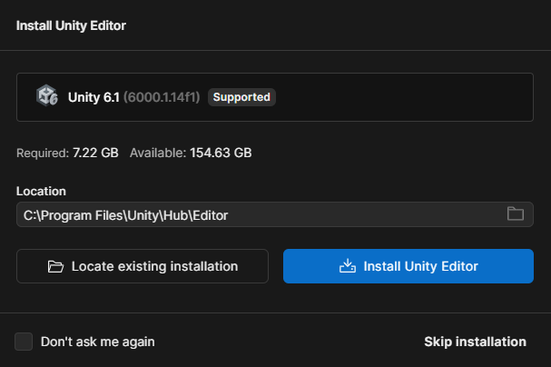
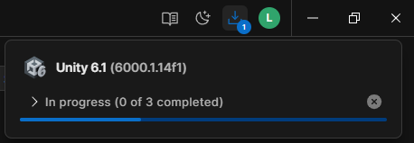

# 📦 Unity

{align=right}

En este primer tema vamos a conocer la herramienta principal sobre la que construiremos todo nuestro proyecto 👉 **Unity**.

Antes de ponernos a crear niveles, `scripts` o físicas, es importante entender qué es exactamente Unity, cómo se instala, por qué es una buena opción para aprender desarrollo de videojuegos y qué nos ofrece en comparación con otras alternativas.

---

## Qué es Unity

**Unity** es un motor de desarrollo de videojuegos **multiplataforma** que permite crear juegos en 2D, 3D e incluso experiencias interactivas como simuladores, aplicaciones de realidad virtual (VR), realidad aumentada (AR) o visualizaciones arquitectónicas.

Lo que hace a Unity tan poderoso es que combina varias herramientas clave en un solo entorno:

* Un editor visual para montar escenas con objetos, luces, cámaras y físicas.
* Un sistema de scripting basado en **C#**, que te permite programar el comportamiento de los objetos.
* Herramientas para importar recursos (imágenes, sonidos, animaciones, modelos 3D).
* Opciones de exportación a casi cualquier plataforma: PC, web, móviles, consolas, etc.

En resumen, Unity es un ecosistema completo que te permite pasar de una idea a un juego funcional sin necesidad de reinventar la rueda.

---

## Por qué usar Unity

Unity es uno de los motores más populares del mundo, y no es por casualidad. Aquí algunas razones por las que es una excelente opción para este y otros proyectos:

✅ Gratuito para aprender

    Unity tiene un plan llamado **Unity Personal**, completamente gratuito para estudiantes, desarrolladores indie y personas con ingresos anuales menores a 100.000 USD. Puedes usarlo sin ninguna limitación en cuanto a funcionalidades.

✅ Multiplataforma

    Con Unity puedes desarrollar para Windows, macOS, Linux, Android, iOS, WebGL, consolas y más… sin tener que reescribir el código para cada plataforma.

✅ Visual + Programación

    Ofrece un entorno visual (Editor de Unity) en el que puedes arrastrar objetos, ajustar parámetros y ver resultados en tiempo real, pero también te permite controlar todo con código, usando C#. Ideal para artistas que están aprendiendo a programar y para programadores que quieren visualizar su trabajo.

✅ Comunidad inmensa

    Al ser tan extendido, encontrarás miles de recursos: tutoriales, plugins, documentación, foros, canales de YouTube, y paquetes ya hechos que puedes integrar fácilmente en tus proyectos.

✅ Usado profesionalmente

    Unity se utiliza tanto en proyectos independientes como en desarrollos profesionales, desde juegos móviles famosos hasta prototipos de empresas como NASA o estudios de animación.

## Instalación

Para instalar Unity necesitamos descargar la herramienta de gestión de los productos de Unity, llamada `Unity Hub` donde podremos seleccionar, además de Unity, otras herramientas de diseño y desarrollo.

Además, necesitaremos un editor de código fuente como Visual Studio Code o Visual Studio.

Por norma general, Visual Studio es más fácil de instalar, pero es verdad que consume muchos recursos y necesitaremos más memoria RAM a la hora de tener abiertos tanto Unity como Visual Studio para desarrollar nuestro juego.

Os recomiendo usar `Visual Studio Code` ya que es más liviano, consume menos recursos y funciona de la misma manera. La única ❌ desventaja es que hay que configurar tanto VSCode como Unity para que funcione correctamente, pero solo tardamos un par de minutos en hacerlo.

### ⬇️ Unity Hub

Unity Hub es una aplicación oficial de Unity que sirve como centro de control para gestionar todos tus proyectos, versiones del motor Unity, módulos adicionales y configuraciones relacionadas con el desarrollo.

Tenemos varias maneras de descargar Unity Hub:

=== "🌍 A través de la web de Unity"
    [🏃‍♂️ Ve a la web oficial de Unity](https://unity.com/es/download){target=blank}

=== "🌐 Usando Winget"
    ```bash
        winget install Unity.UnityHub
    ```

---

#### Instalando Unity

Una vez descargado e instalado, nos preguntará si queremos instalar el 👉 Editor de Unity 👈, seleccionaremos la ubicación donde se copiarán los archivos e instalaremos el software.


/// caption
`Instalando el editor de Unity`
///

---

{align=right width=300}

Una vez seleccionada la ubicación de instalación, el programa empezará a descargar el `Editor de Unity` y se instalará automáticamente junto con ciertas herramientas necesarias que deben instalarse para poder ejecutar Unity en el ordenador.

