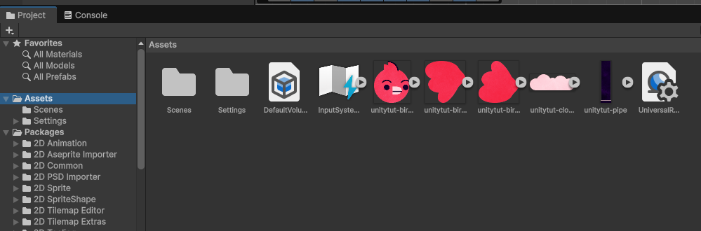
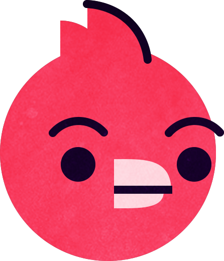
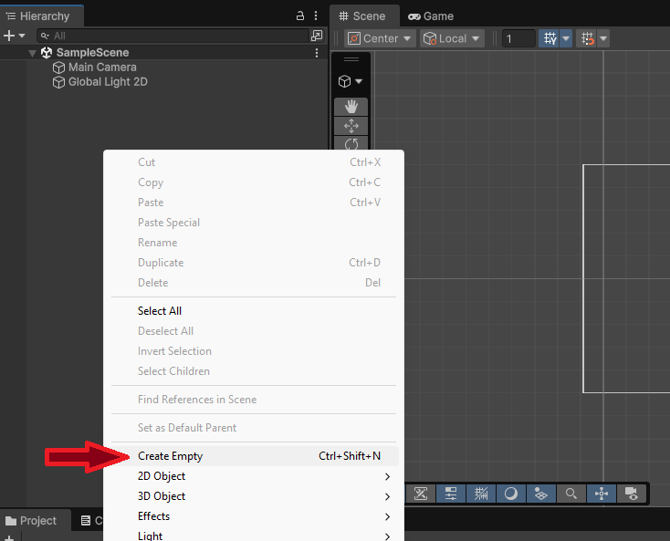
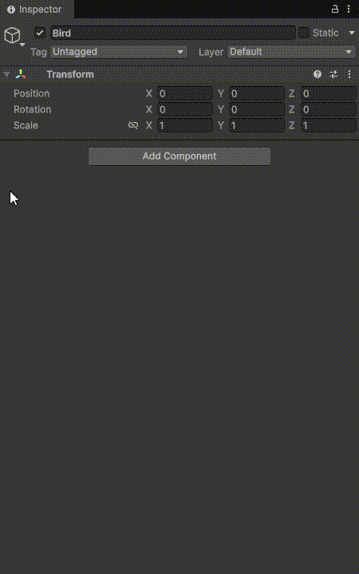

# 🕹️ Diseño del juego

Ya que tenemos el editor de unity instalado en el ordenador y el proyecto creado, empecemos a usar las herramientas que nos brinda Unity para ir creando nuestro juego.

Tras abrir el proyecto con unity, lo primero que vamos a hacer es **importar los sprites** dentro de nuestro proyecto para que podamos usarlos dentro de nuestro juego.

👉 [Descarga aquí](assets/Bërd%20Lawson%20-%20assets.zip) 👈 el archivo **ZIP** que contiene los sprites que vamos a utilizar para este juego.

## Importando los assests

En el área "Project" dentro de la interfaz del **Editor de Unity** (abajo del todo), seleccionamos la carpeta **Assets** y a la derecha pinchamos con el botón derecho del ratón y seleccionamos la opción **Import New Asset...**

Podremos seleccionar todos los assets que queramos importar a nuestro proyecto, independientemente de la extesión que tenga; .png .jpg .mp4 .ogg .mp3

!!!note "Pinchando y arrastrando"
    También podemos pinchar y arrastrar los assets a este apartado del editor para importar los archivos a nuestro proyecto

{ .center }

## Creando el protagonista

{ width="150" align="right" }
Nuestro protagonista es este simpático pájaro que tiene que atravesar las diferentes tuberías que se encuentran a varias alturas. Vamos a crear el **GameObject** relacionado con nuestro colega "Bërd" para darle vida y poder renderizarlo dentro de nuestro juego.

Ahora que ya lo hemos importado en nuestra carpeta **Assets** del proyecto, vamos a hacer uso de los sprites que tenemos. Para ello deberemos crear un nuevo **Game Object** y asignar ciertas propiedades, entre ellas, el asset del pájaro.

Para crear un nuevo **Game Object** pinchamos con  el botón secundario sobre la sección de jerarquía del editor y pinchamos sobre la opción **Create Empty** (o también ***Ctrl + Shift + N*** para los pros)

{ .center }

### ¿Qué es un Game Object

En **Unity**, un **GameObject** es la **unidad básica de cualquier elemento dentro de una escena**. En pocas palabras:

> 👉 Todo lo que ves en un juego hecho con Unity es un *GameObject*.

Puede representar:

* Un personaje
* Una cámara
* Una luz
* Un enemigo
* Un objeto 3D
* Un botón de UI
* Incluso un objeto vacío usado solo para organización

#### 🧱 ¿De qué está compuesto?

Un GameObject por sí solo es como una **caja vacía**. Lo que le da funcionalidad son los **Componentes**. Por defecto, todo GameObject tiene:

* ✅ `Transform` (posición, rotación y escala)

Luego puedes agregarle ciertas propiedades:

* 🎨 `Mesh Renderer` → para que se vea
* 💡 `Light` → para que ilumine
* 🎮 `Collider` → para detectar colisiones
* 🧠 `Script` → para darle comportamiento
* 🎥 `Camera` → para mostrar la escena

#### 🧩 Ejemplo práctico Si creas un cubo en Unity

```
GameObject (Cube)
 ├── Transform
 ├── Mesh Filter
 ├── Mesh Renderer
 └── Box Collider
```

Ese cubo es un **GameObject** con varios componentes.

#### 🏗 Relación jerárquica

Los **GameObjects** pueden tener **padres e hijos**.

Ejemplo:

```
Player (GameObject)
 ├── Gun
 ├── Camera
 └── Shield
```

Si el **Player** se mueve, todo lo que es hijo se mueve con él.

### 🐦‍⬛ Añadiento el sprite

{ align="right" width="350"}
Cuando creamos nuestro **Game Object** le podemos poner un nombre para poder distinguirlo dentro de nuestro proyecto y lo más importante para nuestro personaje 🐦 asignarle el **sprite** que hemos importando.

Para ello, debemos **añadir un componente** a nuestro **Game Object**. Para ello, seleccionamos el objeto y en el **Inspector** pinchamos sobre 👉 ***Add Component*** y seguimos los siguientes pasos para asignarle la imagen como srpite:

- En la lista de componentes seleccionamos **Sprite Renderer**
- En el **Inspector** pinchamos y arrastramos el asset que queramos al input **Sprite**

!!!tip "Visualizando el resultado"
    Ahora que ya tenemos el primer sprite, podemos renderizarlo para ver cómo quedaría el resultado final. Para ello pinchamos sobre el icono de play ▶️ y Unity empezará a renderizar toda nuestra escena.

    Así mismo, podremos cambiar las propiedades de nuestro objeto para poder ajustar el tamaño y demás propiedades.

    👁️ Que no se te olvide establecer una resolución dentro de la escena para ver un ejemplo lo más real posible.