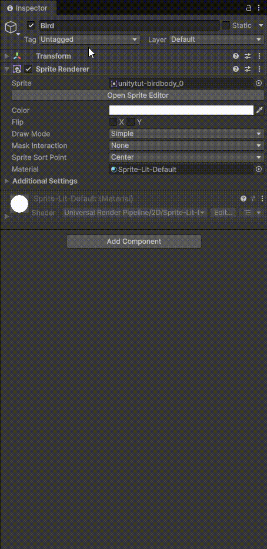
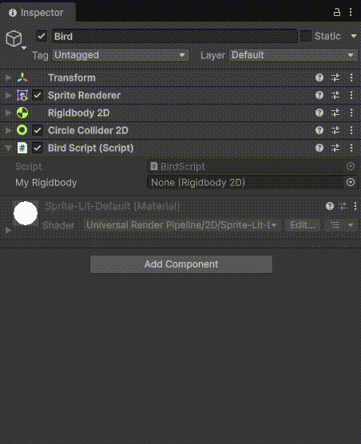

# 🏋️ Físicas y Código del juego

En **Unity**, las *físicas* son el sistema que simula cómo se comportan los objetos en el mundo del juego siguiendo leyes similares a las del mundo real: **gravedad, fuerzas, colisiones, rebotes, fricción, etc.**

En otras palabras, permiten que los objetos **caigan, choquen, se deslicen o empujen** de manera realista (o configurable).

## Componentes principales de las físicas en Unity

### 1️⃣ Rigidbody

Es el componente que permite que un objeto sea afectado por la física (gravedad, fuerzas, impulso).

Si un objeto tiene **Rigidbody**:

* Puede caer por gravedad.
* Puede recibir fuerzas (`AddForce`).
* Reacciona a colisiones.

Sin Rigidbody, el objeto es estático y no se mueve por física.

### 2️⃣ Colliders

Definen la forma física del objeto para detectar colisiones.

Tipos comunes:

* **Box Collider**
* **Sphere Collider**
* **Capsule Collider**
* **Mesh Collider**

💡 Importante:
Un objeto puede tener Collider sin Rigidbody (será un objeto fijo como el suelo).


### 3️⃣ Física 2D vs 3D

Unity tiene dos sistemas separados:

* **Física 3D** → usa `Rigidbody` y `Collider`
* **Física 2D** → usa `Rigidbody2D` y `Collider2D`

No se mezclan entre sí.

## Qué puedes hacer con las físicas

* Crear gravedad
* Detectar colisiones (`OnCollisionEnter`)
* Detectar triggers (`OnTriggerEnter`)
* Aplicar fuerzas
* Simular explosiones
* Crear plataformas móviles
* Hacer juegos de disparos, carreras o puzzles

## 🪽 Añadiendo físicas a nuestro Bërd

{ align="right"}
Para que nuestro juego tenga algo de realismo, tenemos que incluir la mecánica de las físicas, en este caso vamos a agregar el efecto de gravedad a nuestro personaje. Para ello, seleccionaremos el **GameObject** correspondiente en nuestro panel de jerarquía del juego (el de la izquierda) y en el panel del **Inspector** (a la derecha del todo) añadiremos un componente pinchando sobre el botón **Add component** para después seleccionar el componente llamado **Rigibody 2D** 👉 recuerda que puedes escribir el nombre del componente en el input del buscador de componentes que tienes justo encima del listado de componentes

!!!bug "Renderizando el resultado"
    Si lo ejectuamos, veremos que el pájaro cae hacie abajo nada más arrancar el juego

Además de la gravedad, queremos que nuestro protagonista pueda interactuar con el entorno que posteriormente prepararemos, así que **añadiremos un nuevo componente** que tiene como nombre **Circle Collider 2D** a nuestro **GameObject**.

!!!warning "Añadiendo el ***collider***"
    En cuanto agreguemos el componente **Circle Collider 2D**, veremos que en el editor ha aparecido, sobre el asset de nuestro pájaro, un círculo con borde de color verde 👉 ¡Vamos a ajustarlo!

Cada uno de los componentes tiene sus propias propiedades, desde el panel **Inspector** podremos cambiar los valores para dejarlo como más nos guste.

## 📋 Creando nuestro primer script del juego

Un script dentro de Unity es un componente que se le asigna a un **GameObject** como hemos visto anteriormente al añadir el componente de gravedad y el de las colisiones en 2D. En este caso tendremos que seguir los mismos pasos:

> 🐦 Seleccionar nuestro pájaro (GameObject) > Desde el inspector añadimos un componente > Seleccionamos el componente llamado **New script** > Desde el inspector, hacemos doble click sobre el script creado para que se abra ***VisualStudio Code***


### Analizando el código del script creado automáticamente

Veamos el código que se ha generado al añador el componente **New Script**

```csharp
using UnityEngine;

public class BirdScript : MonoBehaviour
{
    // Start is called once before the first execution of Update after the MonoBehaviour is created
    void Start()
    {
        
    }

    // Update is called once per frame
    void Update()
    {
        
    }
}
```

`UnityEngine` es la biblioteca principal que contiene:

* GameObject
* Transform
* Rigidbody
* Debug
* MonoBehaviour
* etc.

Sin esta línea, no podrías usar casi nada de Unity.

---
#### 2️⃣ `public class BirdScript : MonoBehaviour`
---

Estás creando una **clase** llamada `BirdScript`.

En Unity:

* Cada script es una clase
* Esa clase define el comportamiento de un objeto

!!!bug "👀 Ojo cuidao'"
    El nombre del archivo **debe coincidir** con el nombre de la clase.

---
#### 3️⃣ `: MonoBehaviour`
---

Esto es MUY importante.

Significa que tu clase **hereda** de `MonoBehaviour`.

`MonoBehaviour` es la clase base que permite que el script:

* Se pueda añadir a un GameObject
* Use funciones como `Start()` y `Update()`
* Interactúe con el motor de Unity

Si quitas `MonoBehaviour`, el script ya no funcionaría como componente.

---
#### 4️⃣ `void Start()`
---

```csharp
void Start()
{
    
}
```

Se ejecuta **una sola vez**, al comenzar el juego.

Es ideal para:

* Inicializar variables
* Obtener referencias (`GetComponent`)
* Configurar cosas al inicio

Ejemplo:

```csharp
void Start()
{
    Debug.Log("El juego comenzó");
}
```

---
#### 5️⃣ `void Update()`
---

```csharp
void Update()
{
    
}
```

Se ejecuta **una vez por cada frame**.

Si el juego va a 60 FPS → se ejecuta 60 veces por segundo.

Se usa para:

* Detectar input del jugador
* Mover objetos
* Comprobar condiciones constantemente

Ejemplo:

```csharp
void Update()
{
    transform.Translate(Vector3.right * Time.deltaTime);
}
```

Eso movería el objeto continuamente.


#### 🧠 Diferencia importante

| Método | Cuántas veces se ejecuta | Para qué sirve               |
| ------ | ------------------------ | ---------------------------- |
| Start  | Una sola vez             | Inicialización               |
| Update | Cada frame               | Movimiento y lógica continua |


### 🛜 Comunicación entre GameObject y sus componentes

Cuando añadimos el script a nuestro **GameObject**, éste no es capaz de comunicarse entre los distintos componentes que tiene asignados, así que lo primero que tenemos que hacer es establecer esa conexión desde nuestro **Script** de la siguiente manera:

=== "#️⃣ BirdScript.cs"
```csharp
using UnityEngine;

public class BirdScript : MonoBehaviour
{
    // Hacemos que se comunique nuestro GameObject con sus propios componentes
    // Para ello, añadimos las clases que necesitemos
    public Rigidbody2D myRigidbody;

    // Start is called once before the first execution of Update after the MonoBehaviour is created
    void Start()
    {
        // con gameObject accedemos al objeto en si
        // Podremos acceder a cada una de las propiedades, como en este caso
        // .name es el nombre del objeto, que aquí lo establecemos a Bërd Lawson
        // Desde el inspector de Unity, podremos ver cómo cambia de valor al ejecutar el juego
        gameObject.name = "Bërd Lawson";
    }

    // Update is called once per frame
    void Update()
    {
        
    }
}
```

{ align="right" }
Una vez hecho nuestro script, lo siguiente que tenemos que hacer es 👉**enlazar**👈 el componente de ***Rigidbody 2d*** con el script que acabamos de crear, así que pinchamos y arrastramos el componente ***Rigidbody 2D*** desde el inspector hasta el input que hemos creado en el script ➡️ 'My Rigidbody'.

!!!note "Recuerda 👇"

- Creamos el script
- Abrimos el script haciendo doble click
- ***gameObject*** sirve para acceder al objeto en sí
- Los objetos tienen propiedades, las cuales pueden ser accesibles desde el script
- Esas propiedades pueden ajustarse desde el editor de Unity, una vez creadas
- Asigna el componente ***Rigidbody 2D*** en el input del script creado, en nuestro caso se llama **My Rigidbody** que lo encuetras en la línea 7 del script que hemos creado

---

### 🪁 Editando nuestro script enlazado con Rigidbody 2D

Lo siguiente que vamos a hacer es dotar a nuestro *colega* de la habilidad de volar, para ello ¿qué tendremos que hacer? simplemente contrarestar esa gravedad que le hemos impuesto al principio para que sea capaz de elevar su cuerpo.

```csharp
// Update is called once per frame
    void Update()
    {
        myRigidbody.linearVelocity = Vector2.up * 10;
    }
```

En este código lo que hacemos es modificar la velocidad lineal de nuestro **GameObject**, haciendo que su vector velocidad (es un vector porque estamos hablando de un objeto en un mundo de 2 dimensions, en otras palabras, que hay un eje X y otro eje Y) se eleve ***(.up)*** 10 veces.

Pero ¿qué es lo que pasa? que como hemos puesto ese código en la función **Update** se va a ejectuar esa línea de código por cada frame del juego. Ejecuta y mira qué es lo que pasa con nuestro pequeño alado.

!!!bug "Vamos a solucionarlo con un *if* 👇"

```csharp
void Update()
    {
        if (Keyboard.current.spaceKey.wasPressedThisFrame)
        {
            myRigidbody.linearVelocity = Vector2.up * 10;
        }
    }
```

para poder hacer uso de ***Keyboard*** en nuestro código, deberemos importar la librería que toca, en este caso

```csharp
using UnityEngine.InputSystem; // Para poder usar Keyboard o cualquier tecla
```
Así pues, nuestro script tendría la siguiente pinta en este punto 👇

=== "#️⃣ BirdScript.cs"
```csharp
using UnityEngine;
using UnityEngine.InputSystem; // Para poder usar Keyboard o cualquier tecla

public class BirdScript : MonoBehaviour
{
    // Hacemos que se comunique nuestro GameObject con sus propios componentes
    // Para ello, añadimos las clases que necesitemos
    public Rigidbody2D myRigidbody;

    // Creamos la variable flapStrength para poder controlarla desde Unity
    public float flapStrength;

    // Start is called once before the first execution of Update after the MonoBehaviour is created
    void Start()
    {
        // con gameObject accedemos al objeto en si
        // Podremos acceder a cada una de las propiedades, como en este caso
        // .name es el nombre del objeto, que aquí lo establecemos a Bërd Lawson
        // Desde el inspector de Unity, podremos ver cómo cambia de valor al ejecutar el juego
        gameObject.name = "Bërd Lawson";
    }

    // Update is called once per frame
    void Update()
    {
        // Si el usuario pulsa la tecla 'Espacio'
        if (Keyboard.current.spaceKey.wasPressedThisFrame)
        {
            // Cambiamos la velocidad de nuestro objeto (el pájaro) con dirección arriba
            // la multiplicamos por el valor 10 para que haya un cambio sustancial
            myRigidbody.linearVelocity = Vector2.up * flapStrength;
        }
    }
}

```