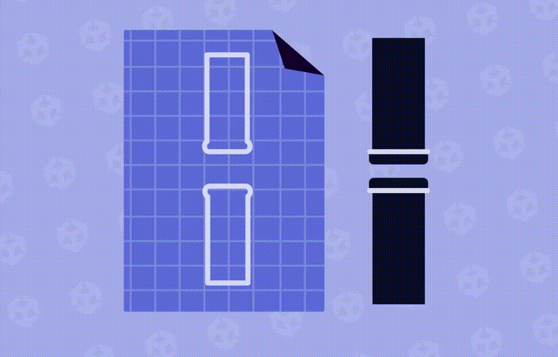
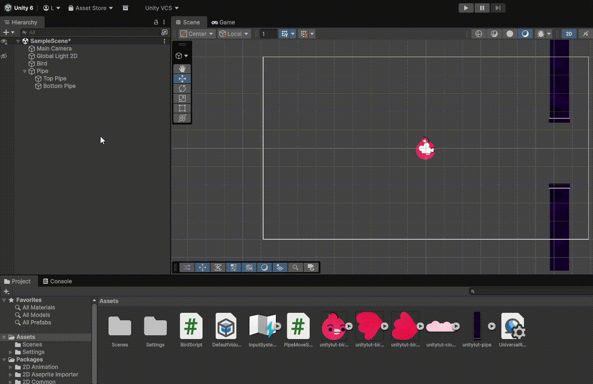
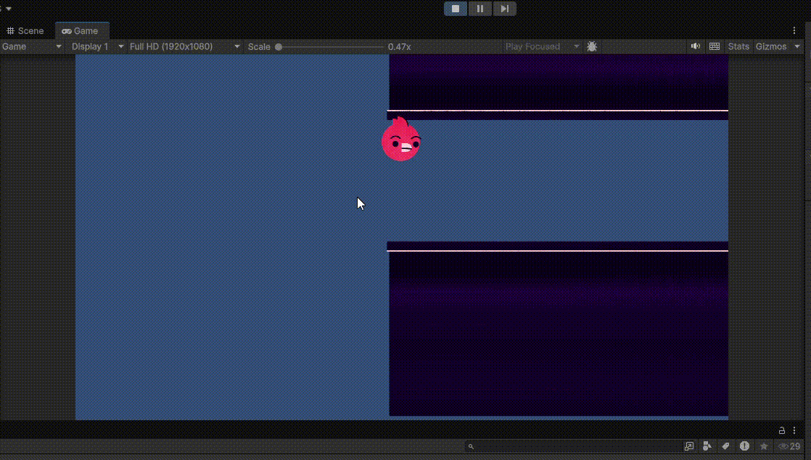

# 🧪 Las tuberias

Ya tenemos a nuestro 🐦 Prota listo para volar, con su gravedad y su **collider** establecido dentro del propio **GameObject**. Lo que tenemos que hacer ahora es crear el **GameObject** para las tuberías y hacer que vayan apareciendo y avanzado por la pantalla.

## La tuberia como ***GameObject***

De la misma manera que hemos hecho con *Bird Läwson* tendremos que crear un **GameObject** nuevo dentro de nuestro juego para poder asociarle el sprite de la tuberia y sus propiedades.

Seguimos los pasos de antes:

- Botón derecho en el panel de **Jerarquía** > ***Create empty***
- Le ponemos un nombre, por ejemplo 👉 ***Pipe***
- Crea otro **GameObject** que se llame ***Top Pipe*** que esté dentro de **Pipe**
- Vamos a situarlo justo en la misma posición que el pájaro
- Asigna el sprite de la tubería a tu nuevo objeto de juego que acabas de crear
- Establece el tamaño idóneo, para que conservar ciertas proporciones
- Añade un componente de colisión **Box Collider 2D** y estable el tamaño que consideres
- Ahora duplica este objeto que hemos creado, el de **Top Pipe**
- Cámbiale el nombre al objeto duplicado, por ejemplo 👉 **Bottom Pipe**
- En las propiedades del objeto, en el apartado ***scale*** pon el valor en negativo
- Establece la posición que quieras para dicha tubería, ten en cuenta el tamaño del protagonista

<video controls style="margin: 20px auto;">
  <source src="../assets/pipes.mp4" type="video/mp4">
  Tu navegador no soporta el video.
</video>

### 📃 Añadiendo el script a nuestra tubería

Ahora que ya hemos acabado con el apartado gráfico de la tubería, necesitamos agregar un script para que se comporte como nosotros queramos. Por lo tanto, añadimos un nuevo script que lo llamaremos 👉 `PipeMoveScript`. ‼️**PERO MUY IMPORTANTE**‼️debemos agregar el script al **objeto padre** no a la tubería top ni a la bottom:

=== "Hierarchy"
```
Main Camera
Global Light 2D
Bird
Pipe 👈 /*\ Añadimos el Script a este GameObject
 ├── Top Pipe
 └── Bottom Pipe
```

Nuestro script tiene que hacer que el **GameObject** de las tuberias (Pipe) se mueva de derecha a izquierda, para que crea un efecto como si el **pájaro** estuviera volando de izquierda a derecha.

Para ello deberemos tocar las propiedad **Transform** dentro de nuestro **GameObject**. Probemos a establecer una velocidad predeterminada, creando una variable que se llame **moveSpeed** y la inicializamos a 5, por ejemplo.

```csharp
using UnityEngine;

public class PipeMoveScript : MonoBehaviour
{
    public float moveSpeed = 5;
    // Start is called once before the first execution of Update after the MonoBehaviour is created
    void Start()
    {
        
    }

    // Update is called once per frame
    void Update()
    {
        transform.position = transform.position + (Vector3.left * moveSpeed);
    }
}
```

!!!bug "Iniciando el juego"
    Mira a ver si consigues ver el movimiento de las tuberias 🏃‍♀️... parece que no, vamos a configurar el DeltaTime mejor. Si revisas los "Stats" dentro del menú de renderizado, en el panel Juego, verás que el juego está cargando a una cantidad absurdamente elevada de FPS.

#### ⌛ Delta Time

En **Unity**, **`deltaTime`** es el **tiempo que ha pasado entre un frame y el siguiente**.

Se usa para que el juego **funcione a la misma velocidad independientemente de los FPS**.

##### 🧠 La idea básica

Los juegos se actualizan **frame por frame**.

Por ejemplo:

| FPS     | Tiempo entre frames |
| ------- | ------------------- |
| 60 FPS  | ~0.016 segundos     |
| 30 FPS  | ~0.033 segundos     |
| 120 FPS | ~0.008 segundos     |

Ese tiempo entre frames es **`Time.deltaTime`**.

##### ⚠️ Problema sin `deltaTime`

Imagina que mueves un objeto así:

```csharp
transform.position += Vector3.right * 5;
```

Esto ocurre **cada frame**.

Entonces:

* A **30 FPS** → se mueve 30 veces por segundo
* A **120 FPS** → se mueve 120 veces por segundo

💥 Resultado: el objeto va **4 veces más rápido** en PCs potentes.

##### ✅ Solución con `deltaTime`

```csharp
transform.position += Vector3.right * 5 * Time.deltaTime;
```

Ahora el movimiento depende del **tiempo real**, no del número de frames.

##### 📊 Ejemplo

Si quieres moverte a **5 unidades por segundo**:

```csharp
5 * Time.deltaTime
```

Si el frame dura:

* **0.016 s (60 FPS)** → mueve `0.08`
* **0.033 s (30 FPS)** → mueve `0.165`

Pero al final del segundo → se moverá **5 unidades igualmente**.

##### 🎮 Ejemplo típico en Unity

```csharp
void Update()
{
    transform.Translate(Vector3.right * 5f * Time.deltaTime);
}
```

Esto significa:

> "Muévete a 5 unidades por segundo hacia la derecha".

##### 🧩 Regla de oro en Unity

Usa **`Time.deltaTime`** cuando hagas cosas que dependen del tiempo:

✅ Movimiento
✅ Rotación
✅ Animaciones manuales
✅ Temporizadores


### 🔰 Corrigiendo el script de las tuberías

Veamos cómo podemos adaptar el **Delta Time** a nuestro códido, dentro del script **PipeMoveScript.cs**. Simplemente deberemos multiplicar nuestro vetor de movimiento y la velocidad por el **delta time**

=== "🔹PipeMoveScript.cs"
```csharp
using UnityEngine;

public class PipeMoveScript : MonoBehaviour
{
    public float moveSpeed = 5;
    // Start is called once before the first execution of Update after the MonoBehaviour is created
    void Start()
    {
        
    }

    // Update is called once per frame
    void Update()
    {
        transform.position = transform.position + (Vector3.left * moveSpeed) * Time.deltaTime;
    }
}
```

!!!info "Documentación oficial 👉 Delta Time"
    Si quieres saber más sobre Delta Time, puedes echar un vistazo a la documentación oficial
    <br>➡️[a través de este enlace](https://docs.unity3d.com/es/530/ScriptReference/Time-deltaTime.html){ target="_blank" }⬅️

#### 🧪🧪🧪 Más tuberías, queremos infinitas!

{ .center width="250"}

La idea del juego es que sea una única escena (pantalla) donde se genere infinítamente nuestro objeto de tubería (tanto la de arriba como la de abajo) y que vayan apareciendo de derecha a izquierda en nuestra escena. Algo así como hacer un `do~while` pero sin condición que pare de crear el objeto tubería. Para ello crearemos el primer **PreFab** que, si no nos acordamos de qué era 👇

!!!note "🗺️ Prefab"
    Es una plantilla de un GameObject que se puede reutilizar en diferentes partes del proyecto. Al modificar el prefab original, todos los objetos instanciados a partir de él se actualizan automáticamente, lo que ahorra tiempo y mantiene la coherencia. Es como un GameObject que has frabicado tú, con sus propiedades y que puedes instanciar en la escena.

para crear nuestro **Prefab** de nuestro objeto **Pipe**, es tan fácil como seleccionar el objeto **Pipe** en el panel izquierdo y arrastrarlo al panel de **Assets**. Una vez hecho esto, ya no necsitamos nuestro objeto **Pipe** en la jerarquía de los **GameObject** así que lo podemos borrar ⬇️

{ width="800" .center }


##### 🗺️ Usando nuestro Prefab en el proyecto

Ahora que ya tenemos nuestros **Planos** de las tuberias para poder crear todas las que queramos, vamos a preparar un nuevo molde, o lo que es lo mismo, un **GameObject** que esté enlazado a este plano. Lo llamaremos **Pipe Spawner** y crearemos un script dentro que se llame **PipeSwpanerScript**.

El siguiente paso será enlazar nuestro **Prefab** al objeto del juego que acabamos de crear **Pipe Spawner**, así que vamos a crear un nuevo input y arrastrar nuestro prefab a dicho input.

##### 🪴 Creando el script de las tuberías

Al enlazar nuestro objeto del juego **Pipe Spawner** con nuestro prefab **Pipe** que hemos creado anteriormente, ya estamos listos para codear el script de las tuberías.

!!!warning "👀 lo que tiene que hacer el script"
    La idea de este script es que vaya creando una instancia de nuestro prefab **Pipe** cada ciertos segundos para que vayan apareciendo tuberías en la pantalla de manera aleatoria.

=== "🔹PipeSpawnerScript.cs"
```csharp
using UnityEngine;

public class PipeSpawnerScript : MonoBehaviour
{
    // Creando el input en el editor de Unity (la propiedad)
    // donde enlazamos el objeto prefab 👉 Pipe
    public GameObject pipe;

    void Start()
    {
        
    }

    void Update()
    {
        // Instanciamos el prefab 'pipe' y le pasamos la posición su rotación
        Instantiate(pipe, transform.position, transform.rotation);
    }
}
```

!!!bug "Bugazo"
    Volvemos al editor de Unity y ejecutamos el juego. Observemos qué es lo que pasa 👇

{ .center width="800"}

Lo que está pasando en este ejemplo es que por cada *frame* que pasa en el juego, se instancia el objeto pipe además de que no estamos controlando cuándo se elimina ese objeto isntanciado. Por tanto, si nuestro juego va a `30 / 60 / 120` FPS se crearán `30 / 60 / 120` instancias de ese objeto **Pipe** por cada segundo de juego que pase, por lo tanto, nuestro sistema se colapsa. Vamos a controlarlo con **Delta Time** y un ***timer*** que vaya controlando cuándo debe dispararse la instancia.

!!!note "⏱️El timer"
    Ten en cuenta que lo que queremos es que se genere una tubería cada *X* segundos para que haya un espacio entre tubería y tubería. Eso es lo que va a hacer este timer, esperarse.

---
##### 🧠 Idea general del script
---

El script está comprobando continuamente:

> “¿Ya pasó suficiente tiempo para crear un nuevo objeto?”

Si **no ha pasado**, sigue contando tiempo.
Si **ya pasó**, crea el objeto y reinicia el contador.

=== "🔹PipeSpawnerScript.cs"
```csharp
using UnityEngine;

public class PipeSpawnerScript : MonoBehaviour
{
    // Creando el input en el editor de Unity (la propiedad)
    // donde enlazamos el objeto prefab 👉 Pipe
    public GameObject pipe;
    public float spawnRate = 2; // cantidad en segundos que debe pasar entre apariciones
    private float timer = 0; // Lo hacemos privado porque no lo vamos a cambiar en ningún sitio


    void Start()
    {

    }

    void Update()
    {
        // Si el contador es MENOR que la tasa de generación
        // Entonces el temporaizador cuenta en 1
        if(timer < spawnRate)
        {
            timer = timer + Time.deltaTime;    
        }
        
        else
        {
            // Instanciamos el prefab 'pipe' y le pasamos la posición su rotación
            Instantiate(pipe, transform.position, transform.rotation);
            timer = 0;
        }

    }
}
```


!!!tip "1️⃣ `timer`"
    Es una variable que guarda **cuánto tiempo ha pasado** desde el último spawn.
    Va aumentando poco a poco.

!!!note "2️⃣ `spawnRate`"
    Es **cada cuánto tiempo quieres generar un objeto**.
    > crear un objeto **cada 2 segundos**.

!!!warning "3️⃣ La condición `if`""
    > Si el tiempo que ha pasado es **menor que el tiempo necesario para generar otro objeto**.

Ejemplo 👇

| timer | spawnRate | Resultado       |
| ----- | --------- | --------------- |
| 0.5   | 2         | sigue esperando |
| 1.2   | 2         | sigue esperando |
| 1.9   | 2         | sigue esperando |


!!!success "4️⃣ Aumentar el tiempo"

```csharp
timer = timer + Time.deltaTime;
```

Esto añade **el tiempo que pasó desde el último frame**.

Por ejemplo:

| Frame | deltaTime | timer |
| ----- | --------- | ----- |
| 1     | 0.016     | 0.016 |
| 2     | 0.016     | 0.032 |
| 3     | 0.016     | 0.048 |

Así el temporizador va subiendo **de forma realista y estable** independientemente del número de `FPS` a los que se esté ejecutando nuestro juego.

---

!!!question "5️⃣ Cuando el tiempo se cumple"

Cuando `timer` llega a `spawnRate`, se ejecuta el `else` y **crea un objeto nuevo**.

`Instantiate` significa literalmente:

> crear una copia de un objeto.

Parámetros:

| Parámetro            | Significado                 |
| -------------------- | --------------------------- |
| `pipe`               | el prefab que quieres crear |
| `transform.position` | dónde aparece               |
| `transform.rotation` | con qué rotación            |

!!!example "6️⃣ Reiniciar el temporizador"

```csharp
timer = 0;
```

Esto hace que el contador **empiece otra vez**.

---
##### 💪 Mejorando el script
---

Ahora ya tenemos el script que genera las tuberías desde el `prefab` que habíamos creado anteriormente, además se controla la generación de la instancia y el juego va sacando tuberías cada cierto tiempo.

Pero hemos notado que las primeras tuberías tardan cierto tiempo en aparecer en pantalla y se ve algo cutre. Lo que podemos hacer es que se cree una instancia de las tuberías **nada más arrancar** el juego. Así que si queremos ese efecto, lo que tendremos que hacer es poner el código de la instancia de las tuberías en nuestra función `Start()` para que sea lo primero que se ejecute cuando se renderice nuestro juego.

=== "🔹PipeSpawnerScript.cs"
```csharp
using UnityEngine;

public class PipeSpawnerScript : MonoBehaviour
{
    // Creando el input en el editor de Unity (la propiedad)
    // donde enlazamos el objeto prefab 👉 Pipe
    public GameObject pipe;
    public float spawnRate = 2; // cantidad en segundos que debe pasar entre apariciones
    private float timer = 0; // Lo hacemos privado porque no lo vamos a cambiar en ningún sitio


    void Start()
    {
        SpawnPipe();
    }

    void Update()
    {
        // Si el contador es MENOR que la tasa de generación
        // Entonces el temporaizador cuenta en 1
        if(timer < spawnRate)
        {
            timer = timer + Time.deltaTime;    
        }
        
        else
        {
            // Instanciamos el prefab 'pipe' y le pasamos la posición su rotación
            SpawnPipe();
            timer = 0;
        }

    }

    void SpawnPipe()
    {
        Instantiate(pipe, transform.position, transform.rotation);
    }
}
```

Si te fijas, hemos creado una función que se llama `SpawnPipe()` que lo que hace es justo lo que buscábamos antes, crear una instancia de las tuberías.

Esta función es llamada tanto al inicio del juego como por cada vez que queramos que se genere un nuevo par de tuberías. Así no repetimos código y limpiamos un poco nuestro script.

#### 🔢 Tuberías con posición aleatoria

---

Ya tenemos las tuberías con su aparición cada X segundos, lo que necesitamos ahora es colocarlas a diferentes alturas para que el juego sea más divertido y dinámico.

Ten en cuenta que las posiciones que van a camabar se realizan sobre su verticalidad, es decir, sobre el eje **Y**, además tendremos que establecer un rango de posición en dicho eje para que, de manera aleatoria, se elija un valor dentro de dicho rango y renderice nuestro **prefab** de las tuberías.

=== "🔹PipeSpawnerScript.cs"
```csharp
 void SpawnPipe()
    {
        float lowestPoint = transform.position.y - heightOffset;
        float highestPoint = transform.position.y + heightOffset;
        Vector3 randomPosition = new Vector3(
            transform.position.x,
            Random.Range(lowestPoint, highestPoint),
            0
        );

        Debug.Log(randomPosition);

        Instantiate(pipe, randomPosition, transform.rotation);
    }
```

>Calcular el punto más bajo

```csharp
float lowestPoint = transform.position.y - heightOffset;
```

Aquí calculamos el **límite inferior** donde puede aparecer la tubería.

* `transform.position.y` → altura del objeto que contiene este script.
* `heightOffset` → cuánto puede moverse hacia arriba o abajo.

>Calcular el punto más alto

```csharp
float highestPoint = transform.position.y + heightOffset;
```

Esto calcula el **límite superior**.

>Crear una posición aleatoria

```csharp
Vector3 randomPosition = new Vector3(
    transform.position.x,
    Random.Range(lowestPoint, highestPoint),
    0
);
```

Aquí creamos una **posición en el espacio 3D**.

Un `Vector3` tiene tres valores:

```
(x, y, z)
```

En tu caso:

| Valor | Qué significa                         |
| ----- | ------------------------------------- |
| `x`   | misma posición horizontal del spawner |
| `y`   | altura aleatoria                      |
| `z`   | 0 (porque es un juego 2D)             |

`Random.Range()` devuelve un número aleatorio entre `lowestPoint` y `highestPoint`.

Ejemplo posible:

```
(10, 3.4, 0)
(10, 6.1, 0)
(10, 7.8, 0)
```

---

>Mostrar la posición en consola

```csharp
Debug.Log(randomPosition);
```

Esto imprime la posición generada en la **Console de Unity**.

Ejemplo de salida:

```
(10.0, 6.23, 0.0)
```

Sirve para **debugging** (comprobar que el código funciona).

>Crear la tubería

```csharp
Instantiate(pipe, randomPosition, transform.rotation);
```

Aquí Unity crea una **copia del prefab `pipe`**.

Parámetros:

| Parámetro            | Significado              |
| -------------------- | ------------------------ |
| `pipe`               | prefab de la tubería     |
| `randomPosition`     | dónde aparece            |
| `transform.rotation` | con qué rotación aparece |

---

>🎮 Qué ocurre en el juego

Cada vez que se llama a `SpawnPipe()`:

1. Calcula un rango vertical.
2. Elige una altura aleatoria.
3. Crea la tubería ahí.

Visualmente:

```
altura aleatoria
      ↓
      pipe

altura distinta
      ↓
      pipe

altura distinta
      ↓
      pipe
```

---