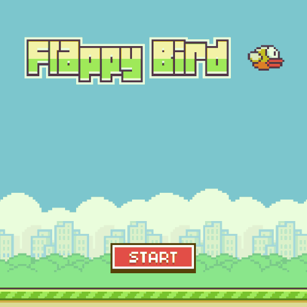

# 🏡 Bienvenid@s
En este tutorial vamos a embarcarnos en la creación de un videojuego 2D inspirado en uno de los fenómenos virales más emblemáticos de la historia del gaming 🐦*`Flappy Bird`*.

Nuestro objetivo no es clonar el juego original, sino reinterpretarlo con nuestro propio enfoque creativo, tanto en mecánicas como en estética, dando lugar a un nuevo título: **Bërd Lawson**.


/// caption
///

Este proyecto será una oportunidad ideal para aprender o reforzar conceptos esenciales del desarrollo de videojuegos con Unity, uno de los motores más populares y versátiles de la industria. Independientemente de si estás empezando o si ya tienes algo de experiencia previa, este tutorial está diseñado para acompañarte paso a paso en el proceso de construcción de un juego completo, desde cero y con herramientas accesibles.

### ¿Qué vamos a construir?

**Bërd Lawson** es un juego arcade en 2D de mecánica sencilla pero adictiva 👉 controlamos a un pájaro que debe volar por un escenario infinito mientras esquiva obstáculos móviles. El jugador solo necesita un botón (la barra espaciadora o acualquier otra tecla) para hacer que el pájaro aletee y gane altura:

```
❌ Si no lo hace, la gravedad lo arrastra hacia el suelo
```

```
❌ Si choca contra un obstáculo o cae, el juego termina
```

Aunque esta dinámica pueda parecer simple, esconde todo un conjunto de elementos que nos permitirán explorar conceptos técnicos muy valiosos:

!!! abstract "Conceptos técnicos a aprender"
    📐 Físicas en 2D<br>
    🧱 Detección de colisiones<br>
    🥎 Generación procedural de obstáculos<br>
    🌊 Control del flujo de juego (inicio, pausa, reinicio)<br>
    🪟 Interfaz de usuario (UI)<br>
    🔢 Puntuación y persistencia de datos<br>
    🍃 Animaciones básicas<br>
    🔊 Sonido y retroalimentación visual

### ¿Por qué un juego como *Flappy Bird*?
{align=left width=250}

Porque, desde el punto de vista pedagógico, *Flappy Bird* (y por extensión *Bërd Lawson*) es un caso de estudio excelente. Nos permite centrarnos en los aspectos fundamentales del diseño y la programación sin que la complejidad técnica abrume el proceso de aprendizaje. Además, la simplicidad de su jugabilidad hace que cualquier mejora, por pequeña que sea, tenga un impacto directo y visible en la experiencia del jugador.

También nos permite abrir la puerta a la creatividad: aunque partimos de una base reconocible, podrás modificar gráficos, físicas, mecánicas o estética para darle tu propio estilo al proyecto. *Bërd Lawson* no es un simple clon; es un lienzo sobre el que aprender, experimentar y expresarse.

### ¿Qué aprenderás con este tutorial?

A lo largo del desarrollo de *Bërd Lawson*, vamos a abordar múltiples temas prácticos del desarrollo de videojuegos con Unity:

!!! bug "Nuevas habilidades"
    📚 Cómo organizar un proyecto 2D en Unity desde cero<br>
    ⚙️ Uso del sistema de físicas `Rigidbody2D` y colisionadores<br>
    👨‍💻 Creación de scripts en C# para gestionar el comportamiento del jugador y los obstáculos<br>
    📦 Programación orientada a eventos para controlar el flujo del juego<br>
    🗺️ Uso de prefabs para generar obstáculos dinámicamente<br>
    🪟 Diseño de interfaces con el sistema `Canvas` de Unity<br>
    🔊 Incorporación de efectos de sonido y animaciones básicas<br>
    🎮 Opciones para exportar el juego a diferentes plataformas

Además, tocaremos algunos principios de diseño de videojuegos: ritmo, dificultad progresiva, retroalimentación audiovisual, y pequeños trucos que mejoran la jugabilidad sin requerir código complejo.

### ¿A quién va dirigido este tutorial?

Este tutorial está pensado para personas que:

* Quieren aprender a usar Unity desde un enfoque práctico.
* Tienen curiosidad por entender cómo se estructura un videojuego completo.
* Buscan un proyecto sencillo pero estimulante para poner en práctica lo aprendido.
* Desean experimentar con mecánicas arcade y diseño minimalista.
* O simplemente, disfrutan de los retos creativos.

No necesitas conocimientos previos avanzados en Unity ni en programación, aunque saber lo básico de C# te ayudará. Si es tu primer contacto con Unity, este proyecto será una excelente puerta de entrada. Si ya tienes experiencia, te servirá como base para personalizar y expandir.